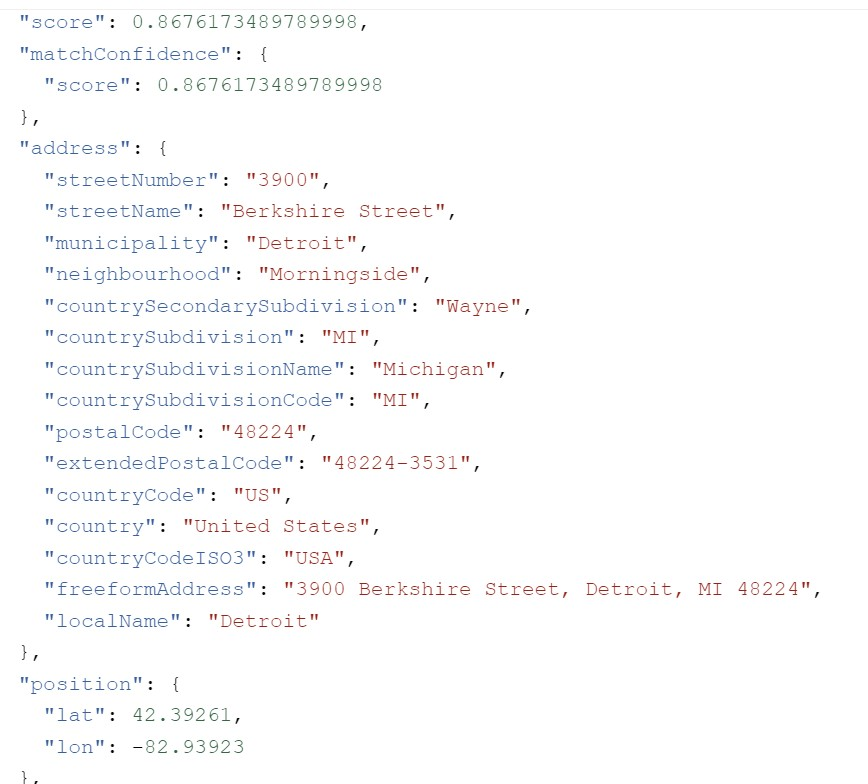

# Enrichment API

I completely rewrote the API in a new Azure Function in VS Studio.  We were having odd issues with deploying to Azure from VS Code and I needed to refactor the code anyway.

## POST /api/EnrichData

This endpoint exposes a POST method/operation that allows the client to Enrich the address data for a Missing Person record in SQL.  There is a IsEnriched column if this column is set to **False** for the provided record it will pass the Missing From address to the Azure Maps API which performs a simaliarity search returning Latitude, Longitude some some other data that would be helpful for Missing Persons.  

This endpoint allows you to pass either an empty JSON payload in the request body which will result in all the records in SQL being **enriched** or a specific record being **enriched**.  Below is an example of the Requst Body when you want to **enrich** record with **ID =1**

   ~~~
      { "id" : 1}
   ~~~

### Example of Azure Maps API Response

## GET /api/HealthCheck
This endpoint is designed to allow the client of the endpoint check the **Health** of the API.  Currently it is stubbed out, but you would simply add logic that would check that the various dependant services are up and available i.e. SQL, Storage Acount etc.

## EnrichData48HourTimer
This is an Azure Function that is scheduled to run every 48hrs.  When executed it simply checks the IsEnriched column of all records for for each with that is set to **False** it will attempt to enrich the record with additional detail collected from Azure Maps API.

