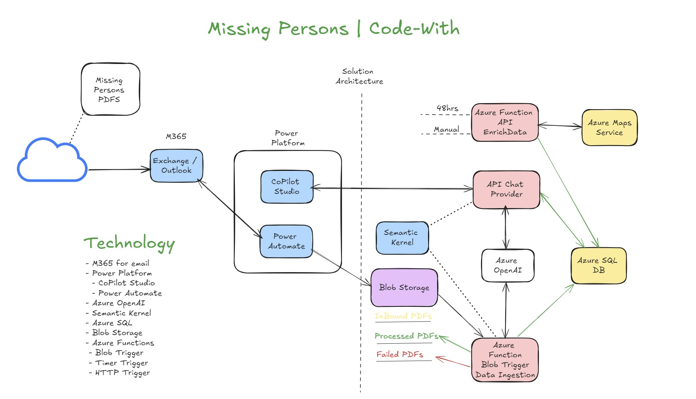
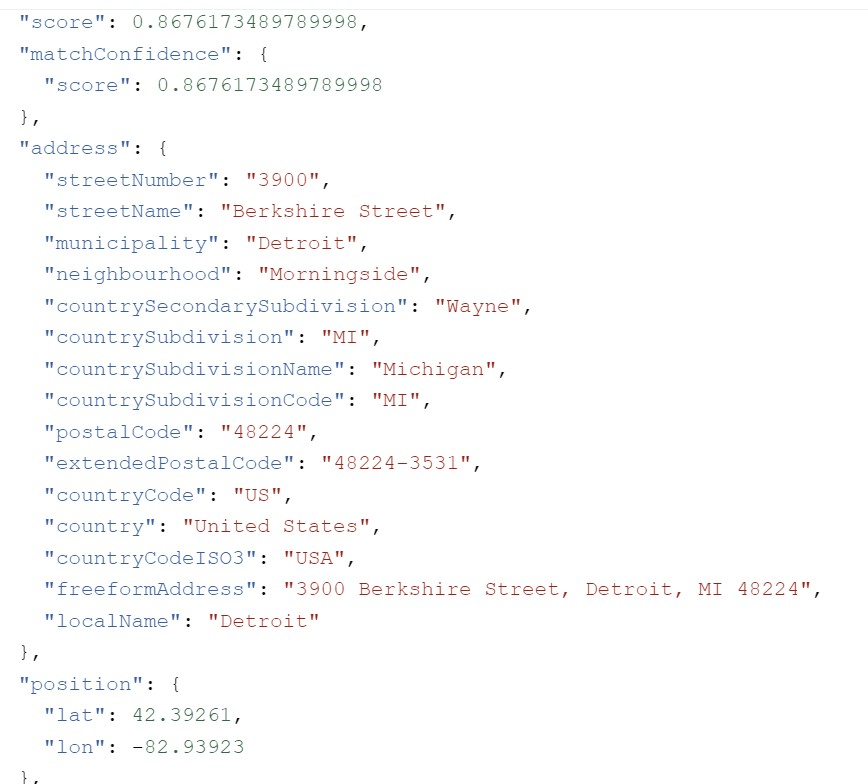

# gen-ai-missing-persons
This solution consists of 2 REST APIs a data ingestion REST API that is triggered when  Missing Person PDF files are uploaded to an Azure Blob Container.  When a PDF is uploaded, the Blob Trigger will parse the contains of the PDF file extracting the Text then it will insert that data into SQL.  The 2nd API is the AI Chat REST service, it allows clients to chat with the data. 

## LICENSE
The [MIT License](./LICENSE) applies to all the solutions / projects / examples included in this repository.  

## Solution Architecture
**Important Note** A Power Platform (low-code / Frontend) is not needed for this.  The solution is designed as a set of APIs so it can be consumed by any client i.e. React, Blazor, Streamlit, NextJS, you name it.   

# blob-trigger-mp-ingest
This is an Azure Function (Blob Trigger) when executed it extracts the Missing Person Data from the PDF file and builds structured data from the PDF and it leverages GenAI for this.  Once the data has been successfully processed it will move the PDF into a Blob Container call **processed-mp-pdfs**.  If the parsing of the data fails it will move the file into a Blob Container called **failed-to-process-mp-pdfs**.  This Blob Trigger is a critical part of the solution as we need to get the **Missing Person** ingested into SQL so we can perform **Natural Language** Q&A using I **ChatProvider API**.

By moving the successfully processed files in a **processed-mp-pdfs** container and moving the PDFs that we failed to process into a **failed-to-process-mp-pdfs** container, you can not take action using tools like Logic Apps, or Power Automate when an event occurs in one of those folders.  For example, if you have a Power Automate Flow that monitors these containers it can send notifications to a Teams Channel when a failure occurs or a new Missing Person PDF has been processed.

# api-process-missing-persons-files
This is the Enrichment API, which has a scheduled Azure Function that runs every 48hrs to enrich the Address Data using Azure Maps API.  This allows us to add things like latitude and longitude, neighbourhood etc.  

# api-missing-persons
This is the GenAI Chat Service that allows any Client to interact with the data in a Chat style manner.  It leverages AI to interact with the data in Natural Language manner.  You are able to ask aggregate style questions about the data, examples below.

   ~~~
      Question: How many people went missing between the months of Oct and Dec?
      Response: A total of 3 people went missing during that timeframe.  
   ~~~

We also have a custom DBQueryPlugin which is used to interact with the DB to collect the data needed to answer the user's question.

## Ideas to Consider
Ideally, you would expose a REST API that exposes CRUD operations for data that is stored in SQL.  This would allow the data to be maintained via the API and could be leveraged from a frontend or any tool that can make REST API requests.

## Azure Maps for GeoCoding

[Click here for example](https://learn.microsoft.com/en-us/azure/azure-maps/how-to-search-for-address#request-latitude-and-longitude-for-an-address-geocoding). Provision an Azure Maps Service, get the client id and key for the service then make a GET request with the address.  Here is an example:

   ~~~
      https://atlas.microsoft.com/search/address/json?subscription-key=<your key>&api-version=1.0&language=en-US&query=3900 block of Berkshire, Detroit
   ~~~

Here is an example of the JSON response you will get back from GET request to Azure Maps Service.

